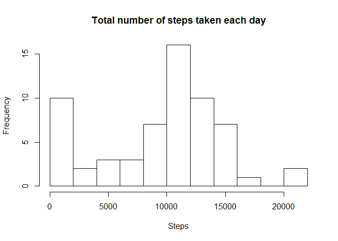
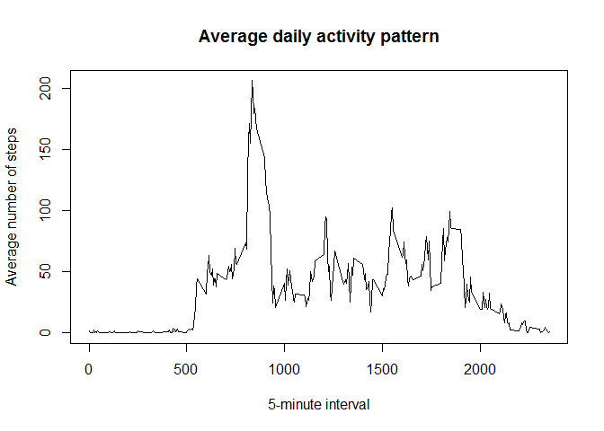
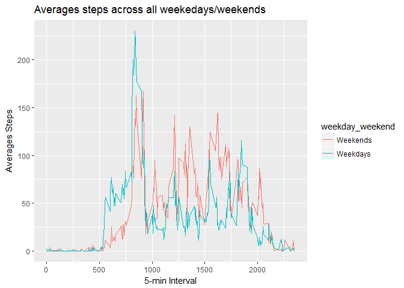

# Reproducible Research Week 2 Project 1

## Reproducible research_Coursera R course

## Week2, Project 1

Instruction can be found here:

https://www.coursera.org/learn/reproducible-research/peer/gYyPt/course-project-1


#### Loading the data

```r
setwd("C:/Users/Xing/Documents/Coursera_R/ReproResearch_Project1")
data <- read.csv("activity.csv")
```

#### Preprocessing the data

```r
data$date <- as.Date(data$date) # Convert the date column as Date
```

### Part A. What is mean total number of steps taken per day?
For this part of the assignment, you can ignore the missing values in the dataset.

#### 1. Calculate the total number of steps taken per day

```r
steps_day_total <- aggregate(data$steps, by= list(data$date), sum,na.rm =TRUE)
colnames(steps_day_total)<-c("date","total steps")
```

#### 2. Make a histogram of the total number of steps taken each day

```r
hist(steps_day_total$`total steps`, breaks = 10, xlab = c("Steps"),main = c("Total number of steps taken each day"))
```

<!-- -->

#### 3. Calculate and report the mean and median of the total number of steps taken per day

```r
mean_steps_day_total <- mean(steps_day_total$`total steps`, na.rm=TRUE) # mean
print(mean_steps_day_total)
```

[1] 9354.23

```r
median_steps_day_total <- median(steps_day_total$`total steps`, na.rm=TRUE) # median
print(median_steps_day_total)
```

[1] 10395

### Part B. What is the average daily activity pattern?
#### 1. Make a time series plot of the 5-minute interval (x-axis) and the average number of steps taken, averaged across all days (y-axis)

```r
steps_interval <- aggregate(data$steps, by = list(data$interval), mean,na.rm =TRUE)
colnames(steps_interval)<-c("interval","steps")
plot(steps_interval$interval, steps_interval$steps, type = "l", xlab = c("5-minute interval"), ylab = c("Average number of steps"), main = c("Average daily activity pattern"))
```

<!-- -->

#### 2. Which 5-minute interval, on average across all the days in the dataset, contains the maximum number of steps?

```r
max(steps_interval$steps) # max number of steps
```

[1] 206.1698

```r
steps_interval[match(max(steps_interval$steps),steps_interval$steps),1] # max number of steps at this interval
```

[1] 835

### Part C. Imputing missing values
Note that there are a number of days/intervals where there are missing values (coded as NA). The presence of missing days may introduce bias into some calculations or summaries of the data.
#### 1. Total number of missing step values in the dataset

```r
sum(is.na(data$steps))
```

[1] 2304

#### 2. & 3. Filling in all of the missing values in the dataset.
Create a new dataset that is equal to the original dataset but with the missing data filled in.
Use the average number of steps for that 5-minute interval.

```r
data_fillNA <- data # duplicate the original dataset
# fill the NA values
for (i in 1: nrow(data)) {
      if (is.na(data$steps[i])) {
            data_fillNA$steps[i] = steps_interval$steps[match(data$interval[i], steps_interval$interval)]
      }
}
# show summary of the dataset after filling in NA values
library(knitr)
kable(summary(data_fillNA))
```

         steps             date               interval    
---  ---------------  -------------------  ---------------
     Min.   :  0.00   Min.   :2012-10-01   Min.   :   0.0 
     1st Qu.:  0.00   1st Qu.:2012-10-16   1st Qu.: 588.8 
     Median :  0.00   Median :2012-10-31   Median :1177.5 
     Mean   : 37.38   Mean   :2012-10-31   Mean   :1177.5 
     3rd Qu.: 27.00   3rd Qu.:2012-11-15   3rd Qu.:1766.2 
     Max.   :806.00   Max.   :2012-11-30   Max.   :2355.0 

####  4. Make a histogram of the total number of steps taken each day 

```r
steps_day_total_fillNA <- aggregate(data_fillNA$steps, by= list(data_fillNA$date), sum, na.rm =TRUE)
colnames(steps_day_total_fillNA)<-c("date","total steps")
hist(steps_day_total_fillNA$`total steps`, breaks = 10, xlab = c("Steps"),main = c("Total number of steps taken each day New Dataset"))
```

-1.png)<!-- -->
Calculate and report the mean and median total number of steps taken per day. 
Do these values differ from the estimates from the first part of the assignment? 

```r
# mean and median data using the new dataset without NA values
mean_steps_day_total_fillNA <- mean(steps_day_total_fillNA$`total steps`, na.rm=TRUE) # mean
print(mean_steps_day_total_fillNA)
```

[1] 10766.19

```r
median_steps_day_total_fillNA <- median(steps_day_total_fillNA$`total steps`, na.rm=TRUE) # median
print(median_steps_day_total_fillNA)
```

[1] 10766.19

```r
# mean and median data using the old dataset with NA values
print(mean_steps_day_total)
```

[1] 9354.23

```r
print(median_steps_day_total)
```

[1] 10395

What is the impact of imputing missing data on the estimates of the total daily number of steps?

```r
print("After filling missing data using the mean steps associated with the specific time interval, the mean and average values increased.")
```

[1] "After filling missing data using the mean steps associated with the specific time interval, the mean and average values increased."

### Part D. Are there differences in activity patterns between weekdays and weekends?
For this part the weekdays() function may be of some help here. Use the dataset with the filled-in missing values for this part.

#### 1. Create a new factor variable in the dataset with two levels - "weekday" and "weekend" indicating whether a given date is a weekday or weekend day.

```r
data_fillNA$'weekday weekend' <-weekdays(data_fillNA$date, abbreviate = TRUE)
data_fillNA$'weekday weekend'<-sub(c("S(at|un)"),0, data_fillNA$'weekday weekend')
for (i in 1:nrow(data_fillNA)){
      if (data_fillNA$'weekday weekend'[i]!= 0) {
            data_fillNA$'weekday weekend'[i]= 1
            }
}
data_fillNA$'weekday weekend'<-factor(data_fillNA$'weekday weekend', levels = c(0,1), labels = c("Weekends","Weekdays")) 
# convert the variable as factors
# 0 as weekend
# 1 as weekday
library(knitr)
kable(summary(data_fillNA))
```

         steps             date               interval      weekday weekend 
---  ---------------  -------------------  ---------------  ----------------
     Min.   :  0.00   Min.   :2012-10-01   Min.   :   0.0   Weekends: 4608  
     1st Qu.:  0.00   1st Qu.:2012-10-16   1st Qu.: 588.8   Weekdays:12960  
     Median :  0.00   Median :2012-10-31   Median :1177.5   NA              
     Mean   : 37.38   Mean   :2012-10-31   Mean   :1177.5   NA              
     3rd Qu.: 27.00   3rd Qu.:2012-11-15   3rd Qu.:1766.2   NA              
     Max.   :806.00   Max.   :2012-11-30   Max.   :2355.0   NA              

#### 2. Make a panel plot containing a time series plot (i.e. type = "l") of the 5-minute interval (x-axis) and the average number of steps taken, averaged across all weekday days or weekend days (y-axis). See the README file in the GitHub repository to see an example of what this plot should look like using simulated data.

```r
steps_interval_week <- aggregate(data_fillNA$steps, by= list(data_fillNA$interval,data_fillNA$'weekday weekend'), mean, na.rm =TRUE)
colnames(steps_interval_week)<-c("interval","weekday_weekend","steps")
library(ggplot2)
p<-ggplot(steps_interval_week, aes(x= interval, y = steps, group = weekday_weekend, colour = weekday_weekend)) +
      geom_line() +
      labs(x ="5-min Interval", y="Averages Steps", title = "Averages steps across all weekedays/weekends")
print(p)
```

<!-- -->
